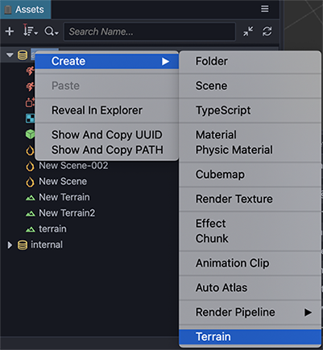

# Terrain system

The __terrain system__ displays the mountainous landscape of nature in an efficient way. Developers can easily use a __brush__ to sculpt *basins*, *mountains*, *valleys*, *plains* and *other landforms*.

## Creating a terrain
Two steps are required to create a terrain:

1. Click the right mouse button in __Hierarchy Manager__ and click __Create -> Terrain__ to create a terrain node. Terrain nodes can be moved, but rotation and zoom are not yet supported.
   
   

2. Click the right mouse button in the __Assets Panel__ and click __Create -> Terrain__ in the pop-up menu to create the necessary terrain assets.
   
   

## Terrain component properties

| Parameter | Description |
| :-----| ----: |
| Asset | Terrain asset |
| EffectAsset | Terrain effect asset |
| ReceiveShadow | Accept the shadow |
| UseNormalMap | Use normal map |
| UsePBR | Use physical materials |

## Using a terrain
Click on the created terrain node. There is a terrain component in the __Inspector Panel__, and the created terrain assets are assigned to the __Asset__ in the terrain component.

## Editing a terrain
After assigning the terrain assets, the editing panel can be accessed from the `Scene`. The terrain editing system includes three major functions: *management of terrains*, *sculpting terrains*, and *painting terrains*. These three functions can be switched between by clicking on the corresponding tabs. It is also possible to switch between each more using the 
 icon on the toolbar.

### Management of terrains
Management is adjusting various parameters of a terrain. Tile is the smallest unit of terrain. Tile constitutes one 32x32 block of tiles with each terrain needing to consist of at least one tile block.

Parameter | Description
---|---
*TileSize* | The size of the terrain tile. Currently, a terrain block consists of 32 x 32 tiles, so the side length of a terrain block is 32 x TileSize.
*BlockCount* | Number of terrain blocks in two dimensions
*WeightMapSize* | Weight map size
*LightMapSize* | Lightmap size

### Sculpting a terrain
Sculpting is changing the shape of a terrain.

#### Brush function
Brush controls are as follows:

- Up/Down, left mouse button/Shift+left mouse button.
- Smooth, raised and depressed operations tend to make the terrain look sharp.

#### Brush type
Currently only round brushes are supported. The brush can have the following parameters:

Parameter | Description
---|---
*BrushSize* | The size of the brush
*BrushStrength* | Brush strength
*Brush Falloff* | Brush falloff, this value determines the sharpness of the brush edge. 0.0 means that the brush has full effect in the whole range (all covered by the current layer texture), with sharp edges, 1.0 means that the brush has full effect only in its center, and the influence will be attenuated when reaching the edge.

### Painting a terrain
Painting is the texture used to depict the appearance of a terrain.

Parameter | Description
---|---
*DetailMap* | Current Layer texture
*TileSize*| The tile size of the texture. The smaller the value, the more tiles will be used in the same size area.

#### Layer editing
1. Click +/- to add and delete layers (up to __4 layers__ are supported).

   

2. After selecting a Layer, you can edit the *DetailMap* and *TileSize* parameters.
   
   

