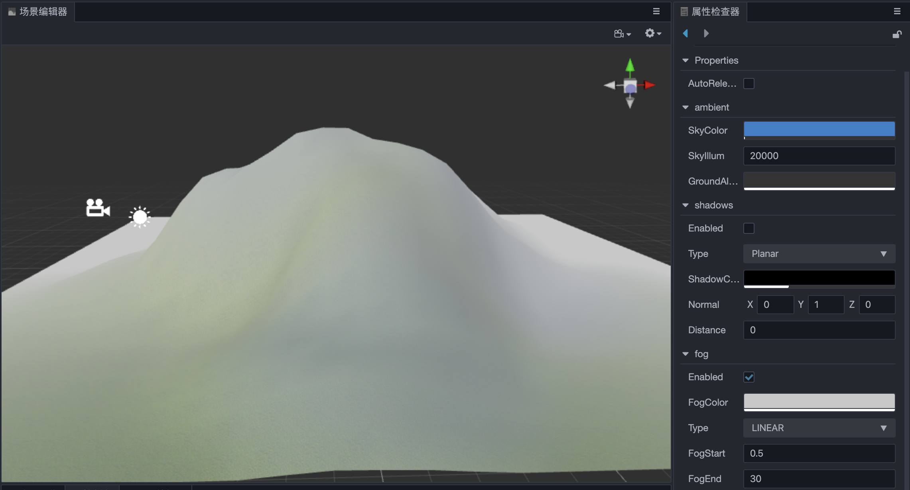
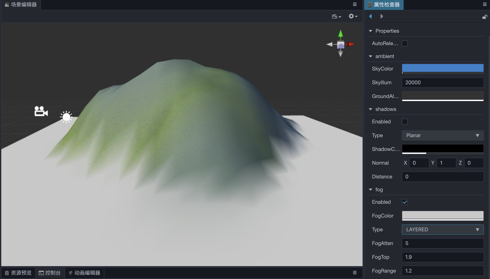

## 全局雾类型

引擎内部提供了四种全局雾类型:

1. Linear Fog
2. Exponential Fog
3. Exponential Squared Fog
4. Layered Fog

所有雾化类型的求取都可以根据雾化的混合因子求出不同效果类型的全局雾功能。

### Linear Fog

线性雾的混合因子的算法通过:

**f = (FogEnd - Cam_dis) / (FogEnd - FogStart)；**

也就是:

当Cam_dis = FogEnd时，混合因子为0，此时物体为全雾化，

当Cam_dis = FogStart时，混合因子为1，此时物体不受任何雾化影响。

### Exponential Fog 与 Exponential Squared Fog

Exponential Fog的混合因子f的求取通过如下的方式：

**f = e^(-distance * fogDensity)**

Exponential Squared Fog的混合因子求取如下：

**f = e^(-distance * fogDensity)²**

除了可以通过fogDensity调整全局雾浓度外，还新增了fogAtten属性，它可以用于调整雾化系数至项目中合适的位置。

### Layered Fog

Layered Fog的计算相对前面三种雾化类型的计算稍显复杂，引入了FogTop的概念，同时需要在x-z平面进行距离计算。

FogAtten: 雾化衰减系数。

FogTop: 物体顶点的世界坐标垂直方向上的位置，小于该位置的所有顶点都会受到雾化效果的影响。

FogRange: 雾化效果影响的范围。
